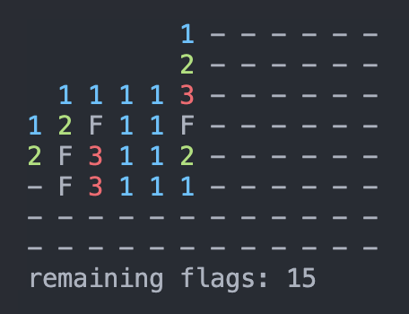
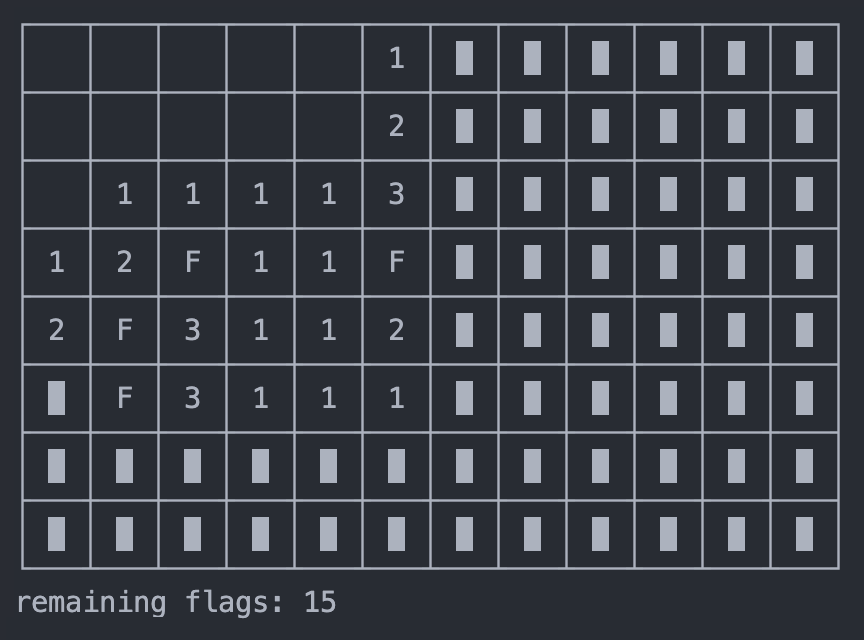

# rust-minesweeper
A command-line minesweeper game with mouse support.

Key                          | Action
---------------------------- | -----------
Mouse, Arrow keys            | Navigate the board
Left Click, Enter, Space     | Open the selected cell
Right Click, Middle Click, F | Flag the selected cell
Tab, T                       | Change theme
H                            | Show a hint
Ctrl+C, Q, Esc               | Exit the game

## Usage
```
Usage: rust-minesweeper [OPTIONS]

Options:
  -s, --size <SIZE>
          The board size [default: 12x8]
  -b, --bomb-percentage <BOMB_PERCENTAGE>
          The bomb percentage [default: 0.2]
  -t, --theme <THEME>
          The board theme (colored, border, dark_border, borderless, colored_borderless) [default: colored]
  -h, --help
          Print help
  -V, --version
          Print version
```

## Available Themes
Use the `--theme` cli argument or press 'Tab' in the middle of the game to change the theme.

### Colored Theme

### Borderless Theme

### Colored Borderless Theme

### border theme

### Dark Border Theme


